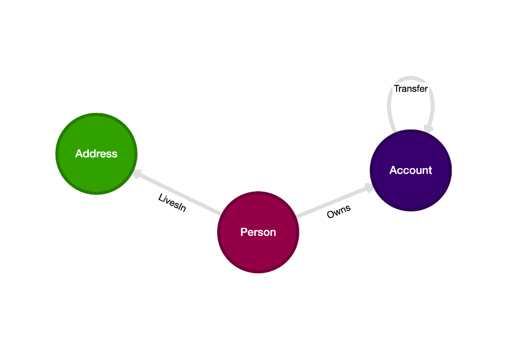
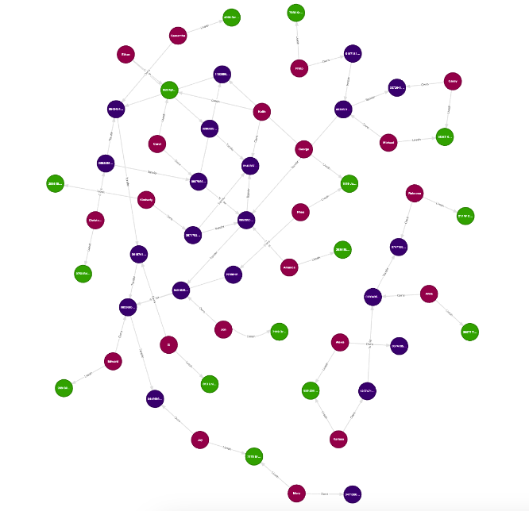

# TMLS 2024 Workshop

This repo provides the code for the Toronto Machine Learning Summit 2024 Workshop held in Toronto,
titled "*Kùzu - A fast, scalable graph database for analytical queries*".

[Kùzu](https://github.com/kuzudb/kuzu)
is an embedded graph database built for query speed and scalability. It is optimized for handling
complex join-heavy analytical workloads on very large graphs. It implements the property graph
data model via a Cypher query language interface. At the end of this workshop, you'll take away
some insights into how to use Kùzu for graph analysis and machine learning tasks, and also see
how easy it is to use!

## Workshop Outline

This workshop will be divided into two parts.

### 1. An intro to graph analysis using Kùzu and Cypher

We will be working on a simple dataset of a financial network. The aim is to write Cypher queries to do
a graph analysis. To contrast it with a SQL-based analysis using a relational database, we will
also answer the same questions that are asked via Cypher with SQL queries in DuckDB, an embedded
relational database. Along the way, it will become clear that some kinds of questions are actually
*really* hard (or borderline impossible) to answer in SQL, but are quite easy in Cypher.

### 2. Machine learning and graph question-answering in Kùzu

This section builds on the previous one. We will showcase the interoperability of Kùzu with the
Python data science, machine learning and AI ecosystem. We will use the existing financial network
to a) run a graph algorithm using NetworkX b) understand how Kùzu can be used as a graph backend for
machine learning using PyTorch Geometric, and c) answer questions using natural language using the Kùzu-
Langchain `GraphQAChain` interface.

## Usage

We will largely be interacting with Kùzu using its web-based UI, [Kùzu Explorer](https://docs.kuzudb.com/visualization/).
You can download the latest image of Kùzu Explorer from DockerHub provided using the provided `docker-compose.yml` file.
To do that, you can run the following commands in the directory where the `docker-compose.yml` is:
```bash
docker compose pull
docker compose up
```

Alternatively, you can type in the following command in your terminal:

```bash
docker run -p 8000:8000 \
           -v ./ex_kuzu_db:/database \
           -v ./data:/data \
           -e MODE=READ_WRITE \
           --rm kuzudb/explorer:dev
```

> [!NOTE]
> In this workshop, we will be working with the `kuzudb/explorer:dev` build of Kùzu Explorer to get access to the latest features
> at the current moment in time. These features will all make their way into the stable release in the near future.
> In your own work, it's recommended to use `kuzudb/explorer:latest`, which is the latest stable release, to avoid unexpected bugs.

---

## Problem statement

Imagine you are an investigator at an organization that tracks financial crimes. Two email addresses
have been flagged by law enforcement agencies, and both are now under suspicion for their potential
involvement in fraudulent activities.

Your task is to analyze some data that consists of money transfers between individuals to assist in
the ongoing investigation. The findings from this analysis will be crucial for an upcoming court case.
To achieve this, you will delve into the dataset to uncover hidden patterns, connections, and insights
into the transactions between individuals.

## Dataset

A financial network dataset of persons, accounts, addresses and transfers between accounts is provided.
Its schema can be represented as shown below.



A summary of the dataset is provided below:
- 21 nodes of type `Person`
- 21 nodes of type `Account` (each `Person` has exactly one account)
- 15 nodes of type `Address`
- 42 relationships of type `Transfer`, where the transfers are directed from a source account `s` that has transfered money
to a destination account `d`.

The resulting graph as such has interesting structures and is small enough to visualize all at once
in Kùzu explorer. You can get the below visualization in Kùzu Explorer with the following query:
```
TODO: Prashanth fill this
```
Write the above query in the shell panel of Kùzu Explorer and click the green play button to execute it.
Kùzu Explorer will automatically display the results as a graph visualization.



## Data modelling

The graph schema shown above is based on the following input files.
- `person.csv`
- `account.csv`
- `transfer.csv`

From a relational database perspective, we just have three tables. The person table has an address
column and the account table is connected to the person table via the person ID. The transfer table
contains the source and destination account IDs, and the amount transferred.

From the three tables we begin with, we are able to separate out the required columns for our node and
relationship tables in Kùzu, to give us the following six tables for our graph analysis:

- Node table: `Person`
- Node table: `Address`
- Node table: `Account`
- Relationship table: `Owns` (between `Person` and `Account`)
- Relationship table: `LivesIn` (between `Person` and `Address`)
- Relationship table: `Transfer` (between `Account` and `Account`)

## DDL

The DDL commands are provided in the `ddl` directory. Once they are run,
the required tables will be created in the respective databases.

## SQL queries

The SQL queries that are possible to write for each corresponding Cypher query are provided in the `sql` directory.
it is not required to run these queries for the workshop -- they are provided for reference.

## Cypher queries

The goal of this workshop is to write Cypher queries to answer the questions provided below. Along
the way, we will visualize all query results in Kùzu Explorer and gain a deeper understanding of the
data.

## Queries to answer

| Query | Description
| --- | ---
| 1 | Find all possible direct transfers between two accounts owned by persons with emails `georodaw366@hotmail.com` and `ezimmerman@yahoo.com`. <br>**Hint:** You need to look for transfers both from `georodaw366@hotmail.com` to `ezimmerman@yahoo.com` and vice versa. You can capture relationships in both directions by not specifying the `<` or `>` in your relationship pattern. See the documentation on [undirected relationship patterns](https://docs.kuzudb.com/cypher/query-clauses/match/#match-undirected-relationships) in MATCH clauses.
| 2 | Find all possible connections of type Transfer, including indirect ones up to length k = 5, between the accounts owned by `georodaw366@hotmail.com` and `ezimmerman@yahoo.com`. You can try k > 5 to also see how the number of paths increases rapidly. <br>**Hint:** Specify variable-length or [recursive](https://docs.kuzudb.com/cypher/query-clauses/match/#match-variable-lengthrecursive-relationships) relationships in Cypher using the Kleene star operator `*` followed by the min and max length for the paths. If you want to count the number of paths, you can use `count(*)` in your RETURN clause.
| 3 | Find the shortest connections of type Transfer between the accounts owned by `georodaw366@hotmail.com`and `ezimmerman@yahoo.com`. <br>**Hint:** Kùzu's Cypher dialect has a native clause to match [a single shortest paths](https://docs.kuzudb.com/cypher/query-clauses/match/#single-shortest-path) as well as [all shortest paths between nodes](https://docs.kuzudb.com/cypher/query-clauses/match/#all-shortest-paths). The latter can be used if you there are multiple paths of the same shortest length and you want to retrieve all of them.
| 4 | Find all shortest connections of any type between the persons `georodaw366@hotmail.com` and `ezimmerman@yahoo.com`. We are searching for any possible shortest paths, i.e., the labels of the edges do not have to be only `Owns` and `Transfer`; they can include `LivesIn` as well. That is, the path between the two people can consist of any sequence of any labels. Further there can be multiple shortest paths. <br>**Hint:** Use Cypher's flexible relationahip matching using [multiple labels](https://docs.kuzudb.com/cypher/query-clauses/match/#match-relationships-with-multi-labels) or [any labels](https://docs.kuzudb.com/cypher/query-clauses/match/#match-relationships-with-any-label). 
| 5 | Find 3 persons who have all transferred money to each other (in at least one direction). 
| 6 | **a)** Find an important account that has the highest number of incoming transactions. <br>**Hint:** Use [group by and aggregate](https://docs.kuzudb.com/cypher/query-clauses/return/#group-by-and-aggregations) to *count* of incoming edges. For reference, possible aggregate functions are [here](https://docs.kuzudb.com/cypher/expressions/aggregate-functions/). <br> **b)** Find an important account that has received most dollars. <br>**Hint:** Do a [group by and aggregate](https://docs.kuzudb.com/cypher/query-clauses/return/#group-by-and-aggregations) to *sum* of the amounts on the incoming edges.
| 7 | Find the accounts that are the "most central". We will use the notion of highest “betweenness centrality” (BC). <br> **Note:** This part will be done in Python via the NetworkX library.

> [!NOTE]
> Betweenness centrality is a measure of the number of shortest paths that pass through a node. It is calculated as the number of shortest paths that pass through a node divided by the total number of shortest paths between all pairs of nodes.
